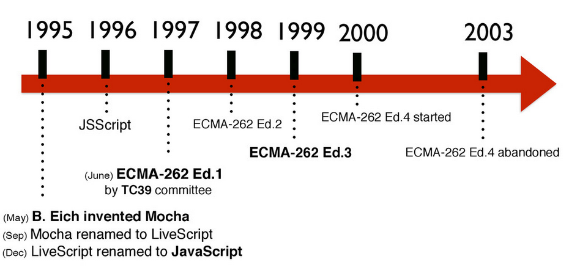
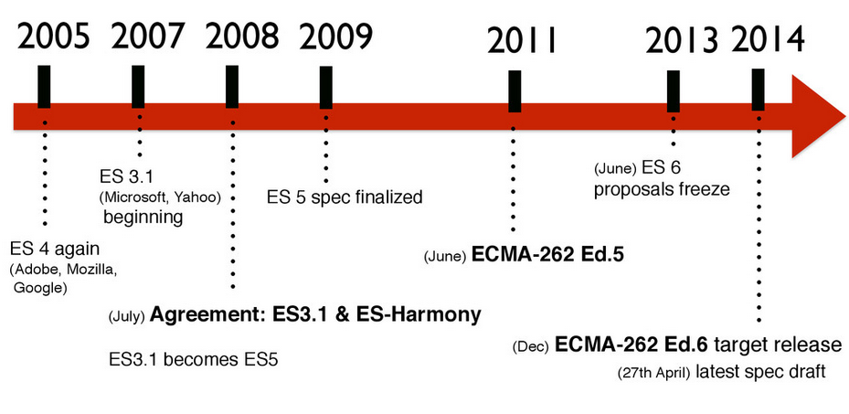

# Clear Ideas about Javascript

* JavaScript is a [interpreted programming language](http://es.wikipedia.org/wiki/Lenguaje_de_programaci%C3%B3n_interpretado) so there's no need to compile the programs to execute them 

* According to a [3 layers separation of a webpage](http://titleandsummary.com/separation-of-layers-content-presentation-and-behavior/), Javascript is in charge of the behaviour's layer:  

  + Content → HTML  
  + Presentation → CSS  
  + Behaviour → Javascript  

  <sub>[http://jeffcroft.com/blog/2007/sep/26/new-layers-web-development/](http://jeffcroft.com/blog/2007/sep/26/new-layers-web-development/)</sub>  

* [Javascript](https://developer.mozilla.org/en/JavaScript_Language_Resources) is based on [ECMAScript](http://es.wikipedia.org/wiki/ECMAScript) (o Ecma-262) that is an especification of the programming language (another "famous" language based on this standard is _ActionScript_).  

* The [different editions of Ecma-262](http://www.ecma-international.org/publications/standards/Ecma-262-arch.htm) and its [implementation in the browsers](http://kangax.github.io/compat-table/es5/) has been crucial for the javascript development over these years 

* With [the arrival of AJAX](http://www.uberbin.net/archivos/internet/ajax-un-nuevo-acercamiento-a-aplicaciones-web.php) (that is just the use of an javascript object that we can use to interact with the server without reloading the page) a new time in the history of this language started

* Javascript has been traditionally used only in the browser, but nowadays is very common its use [in the server](http://net.tutsplus.com/tutorials/javascript-ajax/learning-serverside-javascript-with-node-js/) ([Node.js](http://nodejs.org/)), in [desktop apps](https://nodesource.com/blog/node-desktop-applications) and in [mobile apps](http://phonegap.com/) 

    <sub>[http://www.youtube.com/watch?v=F6k8lTrAE2g](http://www.youtube.com/watch?v=F6k8lTrAE2g)</sub>  
    <sub>[http://clintberry.com/2013/html5-apps-desktop-2013/](http://clintberry.com/2013/html5-apps-desktop-2013/)</sub>  
    <sub>[http://www.hongkiat.com/blog/mobile-frameworks/](http://www.hongkiat.com/blog/mobile-frameworks/)</sub>  

* There are differences on how javascript works on different browsers because of the [different javascript engines](http://developer.telerik.com/featured/a-guide-to-javascript-engines-for-idiots/) implemented in them. Some of them are:

  + Mozilla → Spidermonkey
  + Chrome → V8
  + Safari → JavaScriptCore
  + IE → Chakra
  + Node.js → V8

But the big difference has always been between IE and the rest of the browsers (until IE9)

* These JS ([engines](http://en.wikipedia.org/wiki/JavaScript_engine#JavaScript_engines)) in each browser, perform different types of optimizations in the code. That's why the performance in different according to different browsers

    <sub>[http://jsperf.com/browse](http://jsperf.com/browse)</sub>

* A [library](http://www.desarrolloweb.com/articulos/listado-distintos-framework-javascript.html) is a set of utilities commonly used that can be used to develope applications saving time and effort. The most popular library is [jQuery](https://jquery.com/).


# A brief history of Javascript



- Javascript [was created in 10 days in May 1995](https://www.w3.org/community/webed/wiki/A_Short_History_of_JavaScript) by [Brendan Eich](http://en.wikipedia.org/wiki/Brendan_Eich), under the name of _Mocha_

- The first version of Javascript appears in the browser [Netscape](http://en.wikipedia.org/wiki/Netscape) 2.0  

- On December 1995 SUN Microsystems and Netscape decided to give the name **JavaScript** to it (before it was called _Mocha_ and _LiveScript_) because of a simple matter of pure marketing (_Java_ was the most popular language in those days).

- In 1996 Internet Explorer 3.0 includes its own version of this language which later would be the standard ECMAScript and named it _[JScript](http://en.wikipedia.org/wiki/JScript)_

- In 1997 this language is proposed as a standard and the _European Computer Manufacturers Association_ ([ECMA](http://www.ecma-international.org/default.htm)) take it as that. That's the why of the name **[ECMAScript](http://www.ecma-international.org/publications/standards/Ecma-262.htm)**  

- In June 1997 the [first edition of ECMA-262](http://www.ecma-international.org/publications/files/ECMA-ST-ARCH/ECMA-262,%201st%20edition,%20June%201997.pdf) is published

- In [1998](http://www.w3.org/TR/1998/REC-DOM-Level-1-19981001/) and because of the diferences between the different implementations in the browsers, the _W3C (World Wide Web Consortium)_ designs the standard **[DOM](http://es.wikipedia.org/wiki/Document_Object_Model)** that is an interface (API) to access and modify the structured content (HTML) of the documents.

- In [1999](http://www.ecma-international.org/publications/files/ECMA-ST-ARCH/ECMA-262,%203rd%20edition,%20December%201999.pdf), the modern Javascript (as we know it) starts with the arrival of the third edition of ECMA-262, also called **EcmaScript 3**



- In 2005, the term [AJAX](http://www.adaptivepath.com/ideas/ajax-new-approach-web-applications/) is coined y revolutionizes the world of web development with the arrival of asynchronous web sites (Gmail , Google Maps, ...)

- In [2005](https://jquery.org/history/) the first version of jQuery is launched. Differences between browsers have marked developments until today and it's very common the use of [libraries and frameworks](https://en.wikipedia.org/wiki/Comparison_of_JavaScript_frameworks) (like jQuery) to help us out with these differences.

-  In 2009 the fifth edition of ECMA-262, also known as **ECMAScript 5**, is released. The [edition 5.1](http://www.ecma-international.org/ecma-262/5.1/) is released in 2011

-  In december 2014 the 6th edition of ECMA-262 or _ECMAScript 6_ is approved. 

-  In June 2015 the 6th edition of ECMAScript is launched rebaptised as [**ECMAScript 2015**](http://www.ecma-international.org/ecma-262/6.0/)


# ECMAScript

## EcmaScript 5

**[ECMAScript5.1](http://www.ecma-international.org/ecma-262/5.1/)** was launched on 2011 and we can say that is the [actual Javascript standard](http://blog.oio.de/2013/04/16/ecmascript-5-the-current-javascript-standard/) (2016).  
This version **extends** the previous ones [with some improvements](http://www.jayway.com/2011/04/05/what-is-new-in-ecmascript-5/):

- [`strict mode`](https://developer.mozilla.org/en-US/docs/Web/JavaScript/Reference/Strict_mode)

  ```javascript
  function() {
    "use strict";
  }
  ```

  <sub>[http://cjihrig.com/blog/javascripts-strict-mode-and-why-you-should-use-it/](http://cjihrig.com/blog/javascripts-strict-mode-and-why-you-should-use-it/)</sub>  
  <sub>[http://www.nczonline.net/blog/2012/03/13/its-time-to-start-using-javascript-strict-mode/](http://www.nczonline.net/blog/2012/03/13/its-time-to-start-using-javascript-strict-mode/)</sub>

- [`Object` new methods](http://ejohn.org/blog/ecmascript-5-objects-and-properties/)

  ```javascript
  // Creates an object with parent as prototype and properties from donor
  Object.create(parent, donor);

  // Meta properties of an object
  var descriptor = {
    value: "test",
    writable: true,    // Can the value be changed?
    enumerable: true,  // Will it appear in for-in and Object.keys(object)?
    configurable: true, // Can the property be removed?
    set: function(value) { test = value}, // Getter
    get: function() { return test }       // Setter
  }

  // Methods for manipulation the descriptors
  Object.defineProperty(object, property, descriptor)
  Object.defineProperties(object, descriptors)
  Object.getOwnPropertyDescriptor(object, property)
  Object.getPrototypeOf(object)

  // Returns an array of enumerable properties
  Object.keys(object)
  // Returns an array of all properties
  Object.getOwnPropertyNames(object)

  // Prevents anyone from adding properties to the object, cannot be undone.
  Object.preventExtensions(object)
  Object.isExtensible(object)

  // Prevents anyone from changing, properties or descriptors of the object.
  // The values can still be changed
  Object.seal(object)
  Objcect.isSealed(object)

  // Prevents any changes to the object.
  Object.freeze(object)
  Object.isFrozen(object)
  ```

- [`Function.prototype.bind()`](https://developer.mozilla.org/en-US/docs/Web/JavaScript/Reference/Global_Objects/Function/bind)

  ```javascript
  var tapir = {
    method: function(name){
      this.name = name;
    }
  };
  setTimeout( tapir.method.bind(tapir, "Malayan"), 100 );
  ```

- [`String.prototype.trim()`](https://developer.mozilla.org/en-US/docs/Web/JavaScript/Reference/Global_Objects/String/Trim)

  ```javascript
  >>> var orig = '   foo  ';
  >>> console.log(orig.trim());
  'foo'
  ```

- [`Array` new methods](http://www.jimmycuadra.com/posts/ecmascript-5-array-methods)

  ```javascript
  // Do all elements satisfy predicate?
  Array.prototype.every(predicate)

  // Return a new array with the elements that satisfy predicate?
  Array.prototype.filter(predicate)

  // Call action(element) for each element.
  Array.prototype.forEach(action)

  // What is the index of the first element that equals value?
  Array.prototype.indexOf(value, fromIndex)

  // What is the index of the last element that equal value?
  Array.prototype.lastIndexOf(value, fromIndex)

  // Create a new array by applying unaryFunc to each element
  Array.prototype.map(unaryFunc)

  // Reduces the elements of the array, by applying binaryFunc
  // between the elements
  // [a0, a1].reduce(+ , seed)  == seed + a0 + a1
  Array.prototype.reduce(binaryFunc, seed)

  // Is at least one element satisfied by the predicate?
  Array.prototype.some(predicate)
  ```

- Native [JSON support](https://developer.mozilla.org/en-US/docs/Web/JavaScript/Guide/Using_native_JSON) with [`JSON.parse()`](https://developer.mozilla.org/en-US/docs/Web/JavaScript/Reference/Global_Objects/JSON/parse) and [`JSON.stringify()`](https://developer.mozilla.org/en-US/docs/Web/JavaScript/Reference/Global_Objects/JSON/stringify) 

If we look at the [statistics about the use of browsers](http://clicky.com/marketshare/global/web-browsers/versions/) and the [compatibility of these browsers with ES5](http://kangax.github.io/compat-table/es5/) we can conclude that : _based on ES5, our code will work well on the majority of browsers currently used (2016)_. 

We can give support of some ES5 features in older browsers that doesn't support them by using the proper [shim](https://github.com/es-shims/es5-shim)

## EcmaScript 3

[ECMAScript 3](http://www.ecma-international.org/publications/files/ECMA-ST-ARCH/ECMA-262,%203rd%20edition,%20December%201999.pdf) was launched on 2001 and ALL the browsers ([old](http://www.webdevout.net/browser-support-ecmascript) y modern ones) follow this standard.

It adds (from the previous standard): `do-while`, regular expressions, new `string` methods (`concat`, `match`, `replace`, `slice` , `split` w/ regular expressions, etc.), exception handlers and more. 

## EcmaScript 6

[ECMAScript 6](https://people.mozilla.org/~jorendorff/es6-draft.html) is the latest Javascript standard but still [is not enough implemented](http://kangax.github.io/compat-table/es6/) in the most used browsers.

<sub>[https://6to5.org/docs/tour/](https://6to5.org/docs/tour/)</sub>  
<sub>[https://github.com/ericdouglas/ES6-Learning](https://github.com/ericdouglas/ES6-Learning)</sub>  
<sub>[http://es6rocks.com/](http://es6rocks.com/)</sub>  
<sub>[http://code.tutsplus.com/articles/use-ecmascript-6-today--net-31582](http://code.tutsplus.com/articles/use-ecmascript-6-today--net-31582)</sub>  

This last version adds to the language a lot of [sugar syntax and new features](http://caspervonb.com/javascript/an-overview-of-javascript-in-2015-ecmascript-6/)

Although we can give support of some of this features not supported in browsers by using the proper [shim](https://github.com/paulmillr/es6-shim/)

Also we can use pre-processors [tools](https://babeljs.io/) to work w/ ES6 and automatically convert this code ([transpile](https://en.wikipedia.org/wiki/Source-to-source_compiler)) into the more implemented in browsers ES 5.1


